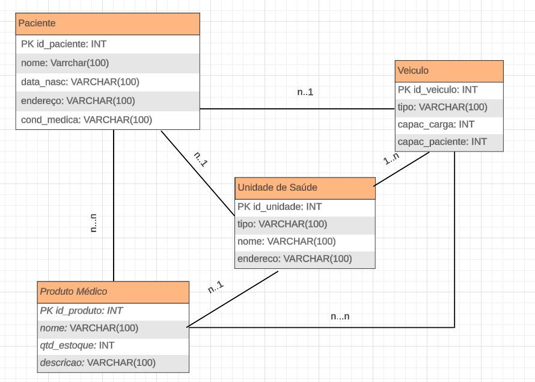
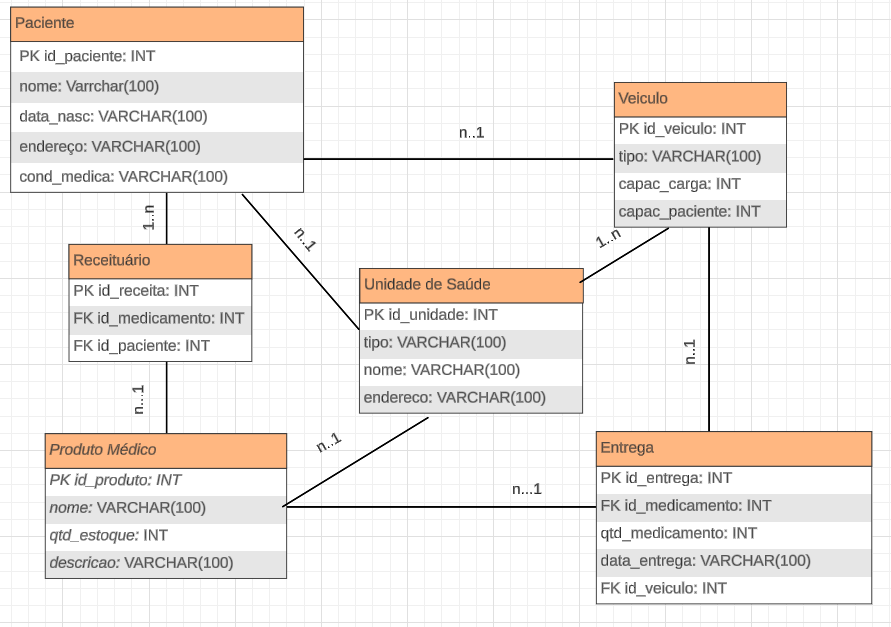

**Modelo de Entidade e Relacionamento para o Sistema de Transporte e Produtos Médicos**

Esta documentação detalha o modelo de entidade e relacionamento para um Sistema de Transporte e Produtos Médicos, abrangendo entidades principais, atributos, relacionamentos, otimização e avaliação, bem como relacionamentos N para N e 1 para N. Também inclui a criação de tabelas intermediárias para gerenciar relacionamentos de N para N entre pacientes, medicamentos e veículos.

---

## Entidades Principais

1. **Paciente:**
   - ID do paciente
   - Nome
   - Data de nascimento
   - Endereço
   - Condição médica

2. **Produto Médico:**
   - ID do produto
   - Nome
   - Descrição
   - Quantidade em estoque

3. **Unidade de Saúde:**
   - ID da unidade
   - Nome
   - Endereço
   - Tipo (hospital, clínica, etc.)

4. **Veículo Médico:**
   - ID do veículo
   - Tipo (ambulância, van, etc.)
   - Capacidade de passageiros
   - Capacidade de carga

## Relacionamentos

1. **Transporte de Pacientes:**
   - Relaciona o paciente com o veículo médico usado para transporte.
   - Atributos adicionais: data/hora de partida, data/hora de chegada, motorista responsável.

2. **Entrega de Produtos Médicos:**
   - Relaciona o produto médico com o veículo usado para entrega.
   - Atributos adicionais: data/hora de saída, data/hora de entrega, responsável pela entrega.

3. **Associação entre Pacientes e Unidades de Saúde:**
   - Pacientes são associados à unidade de saúde onde receberão tratamento.

4. **Associação entre Produtos Médicos e Unidades de Saúde:**
   - Produtos médicos são associados à unidade de saúde onde serão utilizados.

---

Essas são as principais entidades do modelo lógico e podem ser visualizadas nas imagens abaixo:



---

## Relacionamentos 1 para N (Um-para-Muitos)

1. **Pacientes e Unidades de Saúde:**
   - Um paciente é atendido por uma única unidade de saúde.
   - Relacionamento 1 para N entre pacientes e unidades de saúde.

2. **Veículos Médicos e Pacientes/Produtos Médicos:**
   - Um veículo médico pode transportar vários pacientes ou entregar vários produtos médicos.
   - Relacionamento 1 para N entre veículos médicos e pacientes/produtos médicos.

---

## Relacionamentos N para N (Muitos-para-Muitos)

1. **Pacientes e Produtos Médicos:**
   - Relacionamento N para N entre pacientes e produtos médicos.

2. **Unidades de Saúde e Produtos Médicos:**
   - Relacionamento N para N entre unidades de saúde e produtos médicos.

---

## Tabelas Intermediárias

Para representar os relacionamentos de N para N, foram criadas as seguintes tabelas intermediárias:

1. **Tabela "Receituário":**
   - Relaciona pacientes e medicamentos.
   - Campos: ID do receituário, ID do paciente, ID do medicamento, Quantidade do medicamento.

2. **Tabela "Entrega":**
   - Relaciona medicamentos e veículos.
   - Campos: ID da entrega, ID do medicamento, ID do veículo, Data e hora da entrega.


Todas essas tabelas podem ser visualizadas na imagem abaixo:



---

## Consulta Realizada e Resultados

Para calcular o número médio de pacientes transportados por veículo por mês, a seguinte consulta foi realizada:

```sql
SELECT 
    MONTH(data_partida) AS mes,
    YEAR(data_partida) AS ano,
    veiculo_id,
    COUNT(DISTINCT paciente_id) AS pacientes_transportados,
    ROUND(COUNT(DISTINCT paciente_id) / COUNT(DISTINCT DAY(data_partida)), 1) AS media_pacientes_por_dia,
    ROUND(COUNT(DISTINCT paciente_id) / COUNT(DISTINCT MONTH(data_partida)), 1) AS media_pacientes_por_mes
FROM 
    transporte_pacientes
GROUP BY 
    YEAR(data_partida),
    MONTH(data_partida),
    veiculo_id;

```

Os resultados obtidos foram:

| mes | ano  | veiculo_id | pacientes_transportados | media_pacientes_por_dia | media_pacientes_por_mes |
|-----|------|------------|------------------------|-------------------------|-------------------------|
| 5   | 2024 | 1          | 1                      | 0.5                     | 1.0                     |
| 5   | 2024 | 2          | 2                      | 0.7                     | 2.0                     |
| 5   | 2024 | 3          | 1                      | 1.0                     | 1.0                     |

Esses valores refletem a média de pacientes transportados por veículo por dia e por mês, arredondados para um número após o ponto decimal.